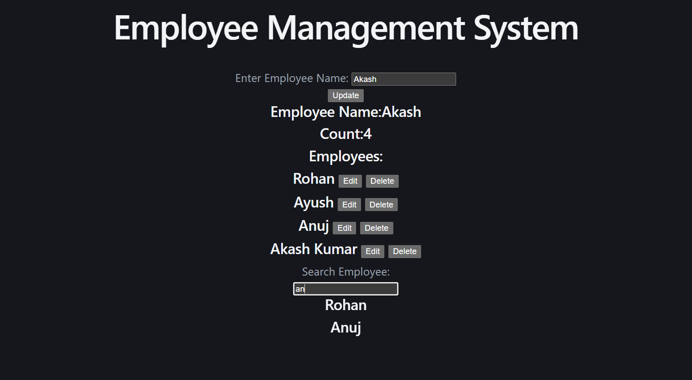

# React Employee Management System

## Project Description

A React-based Employee Management System that allows users to manage employee records efficiently. Users can add, update, delete, and search employees through a simple and interactive interface.

## Features

* Add new employees
* Update employee information
* Delete employee records
* Search employees by name
* Display employee count
* Dynamic employee list rendering using React

## Tech Stack

* React.js
* JavaScript (ES6)
* HTML5
* CSS3
* Vite

## Concepts Used

* React Components
* useState Hook
* Event Handling
* Conditional Rendering
* List Rendering
* Form Handling

## Project Screenshot

## Author

Rohan Soni
